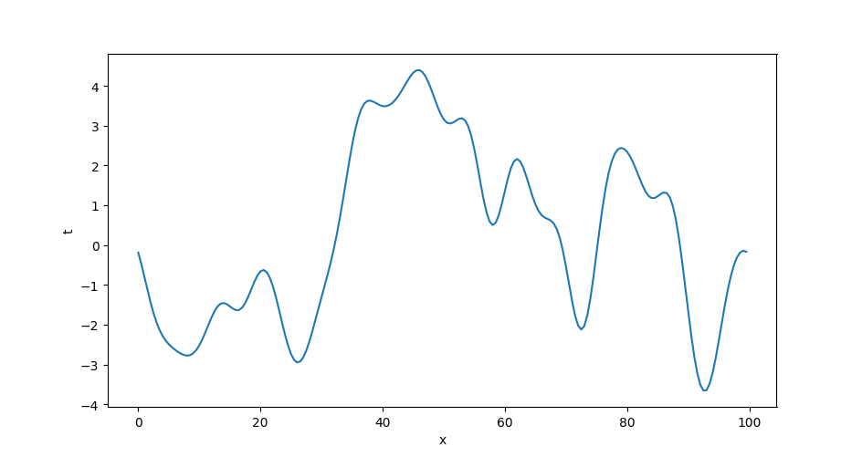
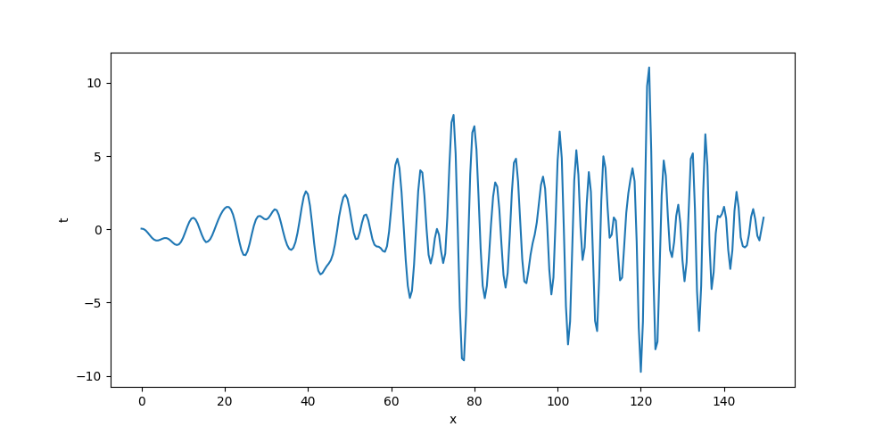

# vznncv-signal-generator

Random process generators library.

Currently library supports only one dimensional gaussian random processes.

The library has two function:

- `generate_process_realization` - this function returns block iterator
  of process realization that can be used to get realization of the
  any length with fixed memory consumption.
 
- `create_process_realization` - the version of the `generate_process_realization` to
  generate process of the fixed length

## Examples

The following code generates stationary random process:

```
from functools import partial

import numpy as np
import matplotlib.pyplot as plt
from vznncv.signal.generator.onedim import create_process_realization


def f_psd_gaussian(f, f_0, alpha):
    """
    One side gaussian psd function

    .. math::

       s = \sqrt{\frac{1}{4 \pi \alpha}} \left(
       e^{-\frac{\left( f - f_0 \right) ^ 2}{4 \alpha}}
       \right)

    :param f:
    :param f_0:
    :param alpha:
    :return:
    """
    return np.sqrt(1 / (4 * np.pi * alpha)) * (
        np.exp(-(f - f_0) ** 2 / (4 * alpha))
    )


fs = 2.0
t = np.arange(200) / fs

x = create_process_realization(
    size=t.size,
    f_psd=partial(f_psd_gaussian, f_0=0.002, alpha=0.001),
    f_m=0.0,
    f_std=2.0,
    fs=2.0,
)

plt.plot(t, x)
plt.xlabel('x')
plt.ylabel('t')
plt.show()
```

Result process:



## Examples

The following code generates process mutable power spectral density:

```
from functools import partial

import numpy as np
import matplotlib.pyplot as plt
from vznncv.signal.generator.onedim import create_process_realization


def f_psd_gaussian(f, f_0, alpha):
    """
    One side gaussian psd function

    .. math::

       s = \sqrt{\frac{1}{4 \pi \alpha}} \left(
       e^{-\frac{\left( f - f_0 \right) ^ 2}{4 \alpha}}
       \right)

    :param f:
    :param f_0:
    :param alpha:
    :return:
    """
    return np.sqrt(1 / (4 * np.pi * alpha)) * (
        np.exp(-(f - f_0) ** 2 / (4 * alpha))
    )


def f_psd(f, t):
    f_0 = 0.02 + t * 0.002
    alpha = 0.001
    return f_psd_gaussian(f, f_0=f_0, alpha=alpha)


def f_std(t):
    return 1 + t * 0.02


fs = 2.0
t = np.arange(300) / fs

x = create_process_realization(
    size=t.size,
    f_psd=f_psd,
    f_m=0.0,
    f_std=f_std,
    fs=2.0,
    window_size=64
)

plt.plot(t, x)
plt.xlabel('x')
plt.ylabel('t')
plt.show()
```


